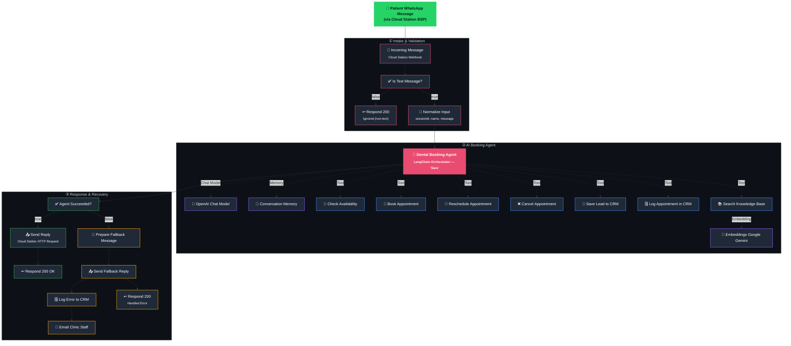

# 🦷 Dental Clinic – AI Appointment Booking Agent

**An AI receptionist for dental clinics that books, reschedules, and cancels appointments over WhatsApp — powered by n8n.**

Patients message the clinic's WhatsApp number, and an AI agent handles the entire booking conversation: checking real Calendar availability, confirming a time, creating the event, answering clinic FAQs from a knowledge base, logging leads to a CRM, and gracefully recovering (with staff email alerts) if anything fails along the way.

<p align="left">
  
  
  
  
  
  
  
  
</p>

---

## 📌 Overview

This repository contains a production-ready **n8n workflow** that turns a clinic's WhatsApp number into a fully autonomous booking assistant.

Rather than connecting through n8n's native WhatsApp/Meta integration, this build talks to WhatsApp through **Cloud Station**, a third-party BSP (Business Solution Provider) — using a generic **Webhook** node to receive messages and a generic **HTTP Request** node to send replies. This Pattern works with any BSP that exposes a webhook + REST send-message API, not just Meta's native integration.

At the center of the workflow sits a single **LangChain AI Agent** ("Sara") that owns the entire booking conversation — asking clarifying questions one at a time, checking real calendar slots before ever offering a time, confirming before booking, and falling back safely if a tool call fails.

---

## ✨ Features :

- 📅 **Real-time calendar booking** — checks live Google Calendar availability before offering any time slot; never invents open slots.
- 🔁 **Full appointment lifecycle** — book, reschedule, and cancel, all handled by the same conversational agent.
- 📚 **Retrieval-Augmented FAQs** — a Pinecone knowledge base answers clinic questions (hours, pricing, insurance, services) instead of the model guessing.
- 🧠 **Conversation memory** — a buffer-window memory node keeps multi-turn bookings coherent (e.g. remembering the date the patient already gave).
- 🗂️ **Automatic CRM logging** — every lead and every confirmed appointment is upserted into Airtable, keyed by patient session ID.
- 🔌 **BSP-agnostic WhatsApp integration** — built on generic Webhook/HTTP Request nodes so it works with Cloud Station or any similar third-party WhatsApp provider, not just Meta's native n8n nodes.
- 🚨 **Multi-layer error handling** — tool-level retry and graceful degradation, an agent-output success check, an immediate fallback WhatsApp reply, error logging to Airtable, and an email alert to clinic staff.
- ✅ **Idempotent webhook responses** — always returns `200 OK` to Cloud Station (even on internal failure) so the provider never endlessly retries the same message.

---

## 🗺️ Workflow Architecture :



<details>
<summary><strong>📄 Prefer a plain-text view?</strong> (click to expand)</summary>

```
Patient WhatsApp Message
        │
        ▼
   Incoming Message (Webhook)
        │
        ▼
   Is Text Message? ──(false)──▶ Respond 200 (Ignored)
        │ (true)
        ▼
   Normalize Input (sessionId, customerName, message)
        │
        ▼
   Dental Booking Agent ──┬── Chat Model → OpenAI
                           ├── Memory     → Conversation Memory
                           └── Tools      → Check/Book/Reschedule/Cancel Appointment (Google Calendar)
                                          → Save Lead / Log Appointment (Airtable CRM)
                                          → Search Knowledge Base (Pinecone + Gemini Embeddings)
        │
        ▼
   Agent Succeeded? ──(true)──▶ Send Reply (HTTP Request) ──▶ Respond 200 OK
        │ (false)
        ▼
   Prepare Fallback Message ──▶ Send Fallback Reply ──▶ Respond 200 (Handled Error)
        │
        ▼
   Log Error to CRM ──▶ Email Clinic Staff
```

</details>

---

## 🧩 Node-by-Node Breakdown :

### Intake & Validation

| Node | Type | Purpose |
|---|---|---|
| **Incoming Message (Cloud Station Webhook)** | `n8n-nodes-base.webhook` | Entry point. Receives inbound WhatsApp events forwarded by the Cloud Station BSP whenever a patient sends a message. |
| **Is Text Message?** | `n8n-nodes-base.if` | Filters out non-text events (reactions, media-only messages, messages sent *by* the clinic itself) so only genuine incoming patient text reaches the agent. |
| **Respond 200 (Ignored)** | `n8n-nodes-base.respondToWebhook` | Returns a `200 OK` for filtered-out events so Cloud Station doesn't treat them as failed deliveries. |
| **Normalize Input** | `n8n-nodes-base.set` | Extracts a consistent `sessionId`, `customerName`, and `message` from Cloud Station's payload shape, decoupling the rest of the workflow from provider-specific field names. |

### AI Booking Agent :

| Node | Type | Purpose |
|---|---|---|
| **Dental Booking Agent** | `@n8n/n8n-nodes-langchain.agent` | The orchestrator — a persona named "Sara" that manages the entire booking conversation: identifying intent (book/reschedule/cancel/FAQ), asking one clarifying question at a time, and calling tools in the correct order. |
| **OpenAI Chat Model** | `@n8n/n8n-nodes-langchain.lmChatOpenAi` | The LLM powering the agent's reasoning and reply generation. |
| **Conversation Memory** | `@n8n/n8n-nodes-langchain.memoryBufferWindow` | Retains recent conversation turns per patient session, so multi-step bookings (date → time → confirmation) stay coherent. |
| **Tool: Check Availability** | `n8n-nodes-base.googleCalendarTool` (`getAll`) | Queries the clinic's shared Google Calendar for free/busy slots within a requested time window. The agent is instructed to **only** offer slots this tool actually returns. |
| **Tool: Book Appointment** | `n8n-nodes-base.googleCalendarTool` (create event) | Creates a calendar event once the patient has explicitly confirmed a specific date and time. |
| **Tool: Reschedule Appointment** | `n8n-nodes-base.googleCalendarTool` (`update`) | Updates an existing event's start/end time after confirming which appointment the patient means. |
| **Tool: Cancel Appointment** | `n8n-nodes-base.googleCalendarTool` (`delete`) | Deletes an existing calendar event by ID. |
| **Tool: Save Lead to CRM** | `n8n-nodes-base.airtableTool` (`upsert`) | Upserts the patient's name, phone, and last message into an Airtable **Leads** table, keyed by session ID. |
| **Tool: Log Appointment in CRM** | `n8n-nodes-base.airtableTool` (`upsert`) | Upserts confirmed appointment details (Google Event ID, doctor, appointment time) into an Airtable **Appointment** table. |
| **Tool: Search Knowledge Base** | `@n8n/n8n-nodes-langchain.vectorStorePinecone` (retrieve-as-tool) | Exposed to the agent as `search_clinic_knowledge_base` — answers general questions (hours, location, pricing, insurance, doctor specialties, policies) grounded in the clinic's real knowledge base. |
| **Embeddings Google Gemini** | `@n8n/n8n-nodes-langchain.embeddingsGoogleGemini` | Generates the vector embeddings used for Pinecone semantic search. |

### Response & Error Recovery :

| Node | Type | Purpose |
|---|---|---|
| **Agent Succeeded?** | `n8n-nodes-base.if` | Checks that the agent produced non-empty output *and* no error — the single gate between the "happy path" and the fallback path. |
| **Send Reply (Cloud Station HTTP Request)** | `n8n-nodes-base.httpRequest` | Delivers the agent's reply back to the patient via Cloud Station's send-message API. |
| **Respond 200 OK** | `n8n-nodes-base.respondToWebhook` | Confirms successful processing back to Cloud Station. |
| **Prepare Fallback Message** | `n8n-nodes-base.set` | Builds a friendly, generic "something went wrong, we'll follow up shortly" message for the patient when the agent run fails. |
| **Send Fallback Reply (Cloud Station HTTP Request)** | `n8n-nodes-base.httpRequest` | Sends the fallback message so the patient is never left without a response. |
| **Log Error to CRM** | `n8n-nodes-base.airtable` (`create`) | Records the failure (error message, patient phone, original message, timestamp, workflow name) to an Airtable **Errors** table for follow-up. |
| **Respond 200 (Handled Error)** | `n8n-nodes-base.respondToWebhook` | Still returns `200 OK` on failure so Cloud Station doesn't retry-loop the same failed message. |
| **Email Clinic Staff** | `n8n-nodes-base.gmail` | Sends an email alert to clinic staff whenever the workflow's configured Error Workflow catches an unhandled failure, including the failed node and error message. |

---

## 🛡️ Error Handling Design

This workflow is built with multiple layers of resilience so patients are never left hanging and failures are never silent:

1. **Tool-level resilience** — every tool node uses `retryOnFail` with `continueRegularOutput`, so a transient Google Calendar/Airtable/Pinecone error doesn't crash the run; the agent sees the error and can respond sensibly instead.
2. **Agent-level gate** — the `Agent Succeeded?` node catches any fully failed or empty agent run before it reaches the patient.
3. **Immediate fallback reply** — on failure, a fallback WhatsApp message is sent right away so the patient isn't left in silence.
4. **Persistent error logging** — every failure is written to Airtable's `Errors` table with the patient's phone, original message, and timestamp for follow-up.
5. **Idempotent webhook response** — the workflow always returns `200 OK` to Cloud Station, success or failure, so the BSP never endlessly retries the same inbound message.
6. **Workflow-level safety net** — a separate Error Workflow (configured under **Settings → Error Workflow**) catches anything that slips past the above layers and emails clinic staff directly.

---

## ✅ Prerequisites & Setup

### 1. WhatsApp via a BSP (Cloud Station or similar)
- An active WhatsApp Business number connected through a third-party BSP such as **Cloud Station** (or any provider offering a webhook + REST send-message API).
- The BSP's inbound webhook/callback URL configured to point at this workflow's **Incoming Message** node.

### 2. n8n Instance
- An **n8n Cloud** workspace or **self-hosted** instance with LangChain community nodes enabled.

### 3. Required Accounts & API Keys
- OpenAI API key (Chat Model)
- Google Gemini API key (Embeddings)
- Pinecone account + populated vector index for the clinic's FAQ knowledge base
- Google Calendar account with a shared clinic calendar and OAuth2 credentials
- Airtable base with **Leads**, **Appointment**, and **Errors** tables, plus OAuth2 credentials
- Gmail (or other email) credentials for staff error alerts
- Cloud Station (or your BSP's) API token for sending outbound WhatsApp messages

---

## 🔑 Environment Variables & Configuration

| Credential / Variable | Used By | Description |
|---|---|---|
| `OpenAI API Key` | OpenAI Chat Model | Authenticates chat completion requests. |
| `Google Gemini API Key` | Embeddings Google Gemini | Authenticates embedding generation for RAG lookups. |
| `Pinecone API Key` + Index Name | Tool: Search Knowledge Base | Access to the clinic's FAQ vector index (e.g. `bright-dental-rag`). |
| `Google Calendar OAuth2` | Check/Book/Reschedule/Cancel Appointment tools | Grants read/write access to the clinic's shared booking calendar. |
| `Airtable OAuth2` | Save Lead, Log Appointment, Log Error | Grants access to the clinic's Airtable base (Leads / Appointment / Errors tables). |
| `Gmail OAuth2` | Email Clinic Staff | Sends failure alert emails to clinic staff. |
| `CLOUDSTATION_API_URL` *(n8n environment variable)* | Send Reply / Send Fallback Reply | Base URL of the BSP's send-message endpoint — kept out of the workflow body via `$vars`. |
| `CLOUDSTATION_API_TOKEN` *(n8n environment variable)* | Send Reply / Send Fallback Reply | Bearer token for authenticating outbound WhatsApp sends — kept out of the workflow body via `$vars`. |

> ⚠️ **Never commit real API keys, tokens, or Airtable base IDs to this repository.** Configure them only through n8n's built-in credentials manager and **Settings → Variables**.

> ℹ️ This workflow assumes a Meta Cloud API–style payload shape (`entry[0].changes[0].value.messages[0]...`) for the incoming webhook, since most BSPs mirror it closely. **Verify Cloud Station's actual payload against the `Normalize Input` node** and adjust the field paths if they differ — see the in-workflow sticky notes for exact guidance.

---

## 🚀 How to Import & Run

1. **Clone this repository**
   ```bash
   git clone https://github.com/<your-username>/dental-clinic-ai-booking-agent.git
   cd dental-clinic-ai-booking-agent
   ```

2. **Open your n8n instance** and go to **Workflows → Import from File**, then select `Dental_Clinic___Ai_Appointment_booking_Agent.json`.

3. **Connect your credentials** on each node listed in the [Environment Variables & Configuration](#-environment-variables--configuration) table above.

4. **Set n8n environment variables**
   - Go to **Settings → Variables** and add `CLOUDSTATION_API_URL` and `CLOUDSTATION_API_TOKEN` (or your BSP's equivalents).

5. **Verify the payload shape**
   - Send yourself one test WhatsApp message.
   - Open the **Normalize Input** node's input panel in n8n and compare the real payload against the expressions used for `sessionId`, `customerName`, and `message`.
   - Adjust the expressions (and the `Is Text Message?` condition) if your BSP's payload shape differs.

6. **Configure clinic-specific values**
   - Update the Google Calendar ID in each calendar tool node.
   - Update the Airtable base/table IDs in the CRM tool nodes.
   - Update the Pinecone index name and populate it with your clinic's FAQ content.
   - Edit the agent's system prompt (clinic name, tone, services) to match your business.
   - Update the staff alert email address in **Email Clinic Staff**.

7. **Register the webhook with your BSP**
   - Copy the **Production Webhook URL** from the **Incoming Message** node.
   - Paste it into Cloud Station's (or your BSP's) dashboard as the inbound callback URL for your WhatsApp number.
   - If your BSP requires a verification handshake, add a second Webhook node (`GET`, Respond Immediately) to echo back their challenge parameter.

8. **Set the workflow's Error Workflow**
   - Under this workflow's **Settings → Error Workflow**, select your global error-handling workflow so failures that slip past the built-in fallback are still caught and alerted on.

9. **Activate the workflow**
   - Toggle the workflow to **Active**.
   - Send a real test WhatsApp message to confirm the round trip: message received → agent responds → reply delivered → leads/appointments logged in Airtable.

10. **Monitor**
    - Use n8n's **Executions** tab to review runs and debug any failures.
    - Check the Airtable **Errors** table periodically for anything flagged during live use.

---

## 📸 Screenshots & Demo

> _Screenshots and a demo walkthrough will be added here._

---

## 🔮 Future Improvements

- 🗓️ **Multi-doctor calendar support** — extend beyond the current single shared calendar to route bookings to individual doctor calendars.
- 🌍 **Multi-language support** — detect the patient's language and respond accordingly instead of a single fixed language.
- ⏰ **Automated reminders** — send WhatsApp appointment reminders 24 hours before a booked visit.
- 📊 **Analytics dashboard** — surface booking volume, no-show rate, and common FAQ topics from the Airtable data.
- 🔐 **Rate limiting & abuse protection** — throttle requests per patient number to prevent spam or prompt-injection abuse.
- 🔄 **Human handoff** — detect complex/edge-case requests and escalate to a staff member via WhatsApp or Slack instead of looping the AI.
- 🧪 **Automated evaluation pipeline** — use n8n's Evaluations tab to regression-test the agent's booking accuracy over time.

---

## 🛠️ Error Handling

> _To be added manually._

---

## 📄 License

This project is licensed under the [MIT License](LICENSE).

---

## 🙋‍♂️ Author

Built and maintained by **[@buildwithareel](https://github.com/buildwithareel)** — exploring AI automation, agentic workflows, and n8n-based systems.  